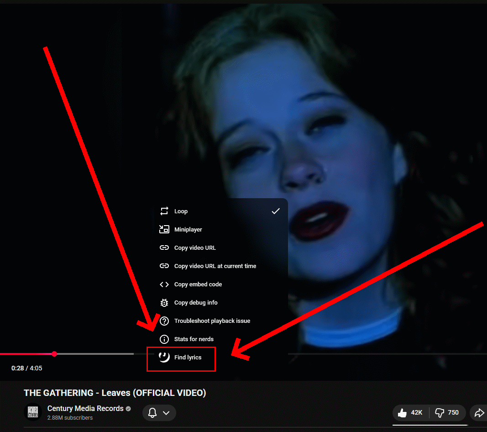

# Lyrix

A based Firefox addon providing a context-menu button to find the lyrics for the played YouTube video.

## Installation

TODO: publish this...

## Usage

[Install the addon](#installation). Open [a YouTube video](https://youtu.be/dQw4w9WgXcQ). Right-click the video player. Press the newly integrated "Find lyrics" button. You'll be taken to [Genius](https://genius.com) to see the lyrics, if available. Gucci!
